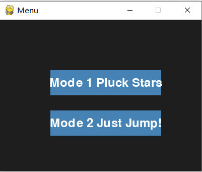
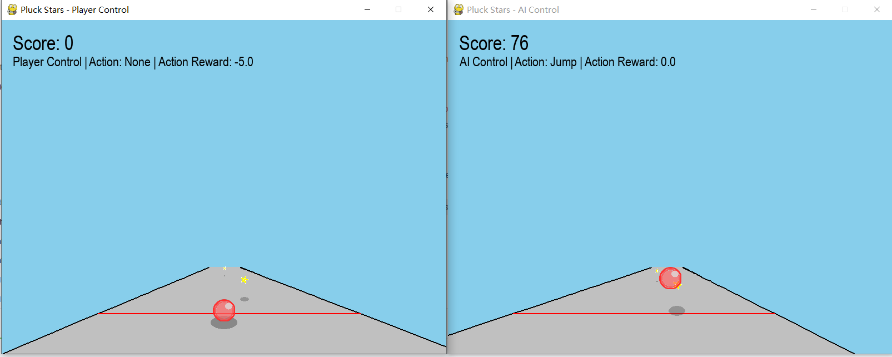
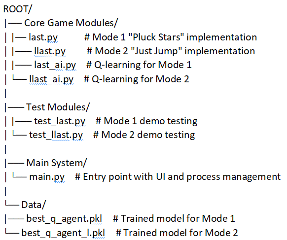
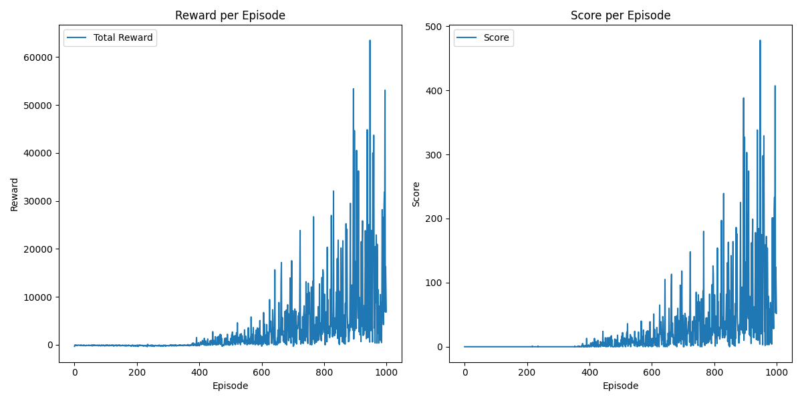
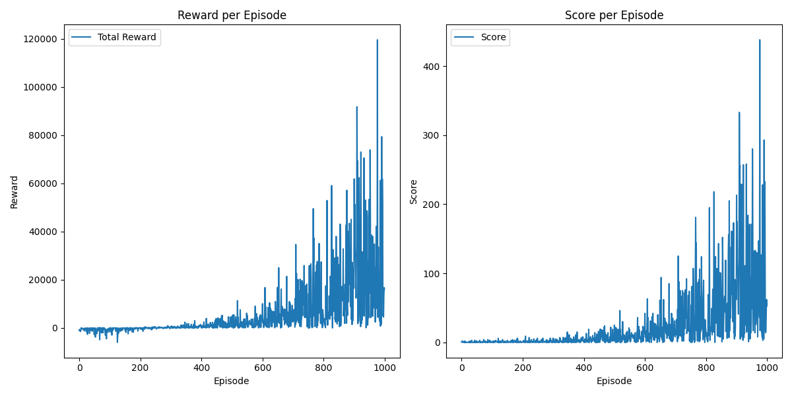

# RL Jump Game
This project implements two 3D platformer modes using Q-learning. Mode 1 ("Pluck Stars") requires jumping toward star-shaped obstacles for scoring, while Mode 2 ("Just Jump") demands precise leaps over dynamically generated cubes.  
  

**Mode 1 (Pluck Stars)**:
  

**Mode 2 (Just Jump)**:     
  


## Table of Contents
- [Game Design](#game-design)
- [Q-Learning Algorithm](#q-learning-algorithm)
- [Game Interaction](#game-interaction)
- [References](#references)

  

  
## Game Design
Mode 1 (Pluck Stars): &nbsp; Control the ball to jump to the star-shaped obstacles and collect points by jumping.  


Mode 2 (Just Jump): &nbsp; Adaptive strategy, jump or avoid dynamically generated obstacles (small/large squares),  
score points by jumping over small obstacles.  
  
    
### Environment:  
Both game modes use similar base environments and are set to simulate a (top-down view) 3D jumping game:  

1. On a straight road, the player (ball) is always at z=0, and obstacles are constantly generated from a distance
and approaching the player's ball (in this way simulating the behaviour of the ball's constant advancement and avoiding
the creation of a complex state design)

2. The player makes four kinds of decisions based on the information reflected in the screen (distance to the next
obstacle): left/right/jump/don’t move (automatic advance), so that the player's ball scores points by jumping to
the star-shaped obstacle (Mode &nbsp; 1) / jumping over the small rectangular obstacle (Mode &nbsp; 2)  
  
  
### State Space:
- **Mode 1 (Pluck Stars)**: &nbsp; [ x_distance, &nbsp; z_distance ]  
- **Mode 2 (Just Jump)**: &nbsp; [ x_distance, &nbsp; z_distance, &nbsp; obstacle_type (Large/Small) ]  

### Action Space:  
- **Action**: &nbsp; [ -1: left, &nbsp; 0: none, &nbsp; 1: right, &nbsp; 2: jump ]

### Reward Function:  
**Mode 1 (Pluck Stars)**:
- Correct movement &nbsp; (+5),   
- Successful jump and pick star &nbsp; (+100),  
- Degree of height matching &nbsp; (+0 ~ 10),  
- Negative: wrong movement &nbsp; (-5),  
- No star picking &nbsp; (-50)
    
**Mode 2 (Just Jump)**:
- Correct movement &nbsp; (+10/5),
- Valid jump &nbsp; (+100)
- Negative: wrong movement &nbsp; (-10/5), 
- Useless jump &nbsp; (-50),
- Collision &nbsp; (-50)  
  
  
## Q-Learning Algorithm  
Q-learning is a model-free RL algorithm that iteratively updates Q-values (Q(s,a)) to learn optimal policies.  
Q-learning learns optimal policies by maintaining a Q-table where each entry Q(s,a) represents the expected cumulative  
reward for taking action a in state s.  

### Why it fits this game
- Finite discrete states: &nbsp; States are obstacle positions (x_distance, &nbsp; z_distance) and types (Mode &nbsp; 2 &nbsp; only).  
- Explicit action space: &nbsp; Actions {-1, &nbsp; 0, &nbsp; 1, &nbsp; 2} (left, &nbsp; stay, &nbsp; right, &nbsp; jump) are discrete and tabularly manageable.  
- Sparse interpretable rewards: &nbsp; Key events (jump success: +100, collision: -50) are tractable for Q-value updates.  
- Real-time Decision: &nbsp; Action selection via table lookup (arg maxQ(s,a)) meets 60FPS real-time requirements.

### Policy Effectiveness
**Prioritized Experience Replay**: &nbsp; Prioritised experience replay is the sorting of experiences by TD error  
(|r + γ maxQ(s′) − Q(s,a)|) and priority replay of high error samples.

**Dynamic ε-Decay**:
- Design: &nbsp; Initial ε=1.0 (full random), decayed by 0.995 per episode (min ε=0.01).
- Early phase: &nbsp; High ε explores diverse actions (e.g., random jump or horizontal movement) to discover potentially highly rewarding paths.
- Late phase: &nbsp; Low ε utilises learned policies (e.g. jumping at the right place and distance) to steadily improve scores.

**Mode 1 (Pluck Stars) training history**:
  

**Mode 1 (Pluck Stars) training history**:
   


  
## Game Interaction  
### Modular architecture  
The system has been designed with modularity in mind, allowing separate processes for the AI agent, the user/AI interface and the game  
environment. This ensures that each component is independent, allowing for modification and further design.  


### Interface design  
  
- menu and subprocess Interface: &nbsp; The MainMenu class provides a user-friendly interface for selecting game modes, and the
co-existence of the user/AI interface makes it easier to compare the user's level of play with that of the AI agent.

- Real-time status display: &nbsp; The user interface displays the current state of the game environment, including the player's
position and any obstacles. This is updated in real time using Pygame's rendering capabilities.

- Action and real-time feedback: &nbsp; User actions (keystrokes) and AI actions (generated by the QLearningAgent) are immediately
reflected in the game environment. The GUI displays the agent's actions and the resulting rewards or penalties.
  
    
## Installation and Usage

### Installation

To set up the environment and run this project, follow these steps:

1. Clone the repository:
   ```bash
   git clone https://github.com/zhentaoliu409/RL_Jump_Game.git
   ```

2. Install the required libraries:
   ```bash
   pip install pygame gzip pickle
   ```
  
  
### Usage  

Try to run the main.py base on trained Q-table, then choose one Mode and enjoy the game.  
   ```bash
      python main.py
   ```

- ⬅️: &nbsp; left shift
- ➡️: &nbsp; right shift
- Space: &nbsp; jump
- (Default stay)

   
## References  
- [State Construction Methods in Reinforcement Learning](https://zhuanlan.zhihu.com/p/466455380)  
- [Feature & State Construction](https://towardsdatascience.com/reinforcement-learning-part-8-feature-state-construction-62e7d2fc5152/)


   

